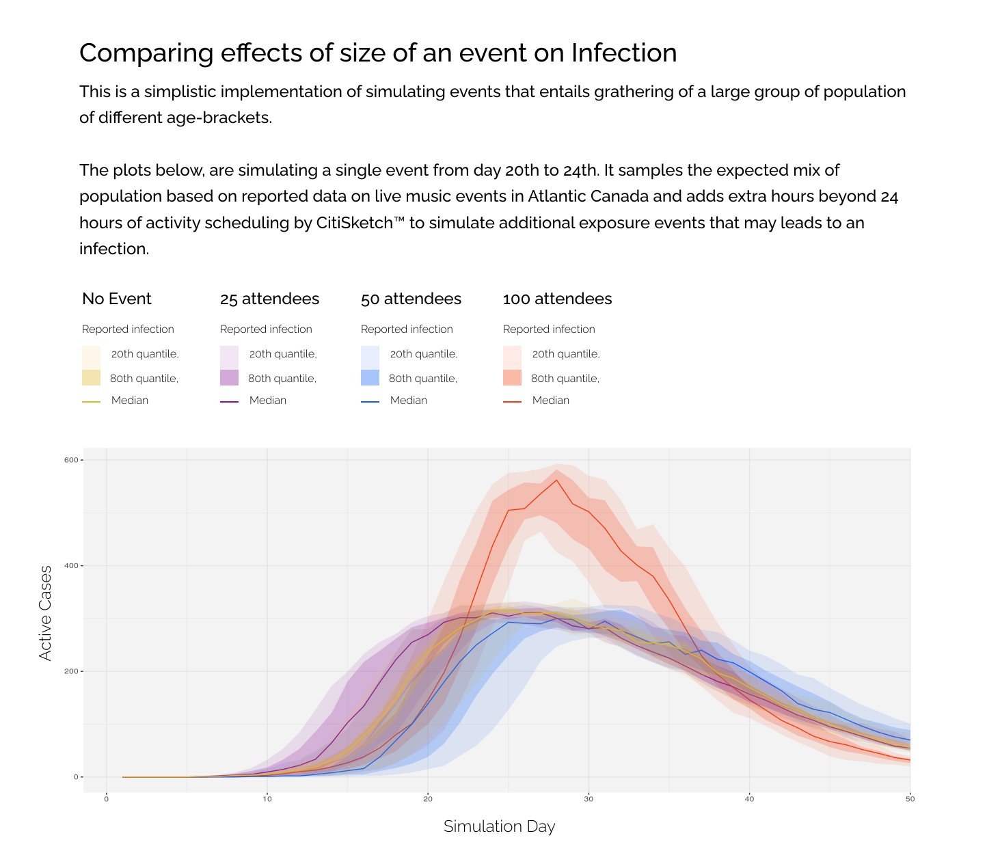

# Simulator Outputs

## Scenario Index
* [Reactive intervention](#reactive-intervention)
* [Superspreading behaviour](#superspreading-bheaviour)
* [Scenario C](#scenario-c)

## Reactive intervention on observable data
This is an example of a reactive intervention strategy, of introducing intervention measures on the basis to total active cases of contagion observed in the community.

&nbsp;
&nbsp;
&nbsp;
&nbsp;

## Superspreading behaviour
Another interesting phenomena of concern is the idea of "super-spreader" events.
Early results from the contagion simulator suggests, it may be an useful tool to investigate and mitigate risks associated with social gatherings.

## Scenario C
