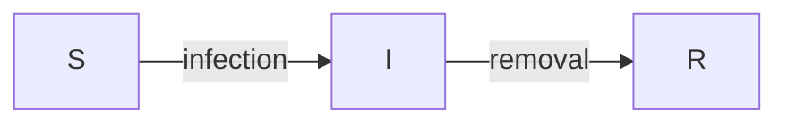
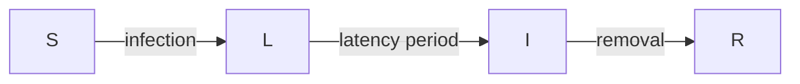

# Contagion Simulator Readme

## Overarching goal
Accommodate individual level network based stochastic contagion simulation over a geography with respect to rapidly changing contexts of pharmaceutical and non-pharmaceutical intervention measures and contagion strains.

## Table of Contents

* [Subgoals](#subgoals)
* [Compartmental models in epidemiology](#compartmental-models-in-epidemiology)
  * [Simulating non-infection edges](#simulating-non-infection-edges)
  * [Individual state management](#individual-state-management)
* [Interpreting contact matrices](#interpreting-contact-matrices)
  * [Aggregated Contact Matrix](#aggregated-contact-matrix)
  * [Location based Contact Matrix](#location-based-contact-matrix)
  &nbsp;
  &nbsp;

## Subgoals
* Ability to design and or import Compartmental models in epidemiology on-demand.
  * Interpret contact matrices with aggregated pairwise contact time and,
  * Interpret contact matrices with location specific contact time (with activity types)
  * Interpret contact times and context to infection probability
  * Simulate non-infection transitions as a sampling of negative binomial distribution.
&nbsp;

* Ability to maintain different proportions of contagion strains.
  * Maintain variants of concerns with relative infectivity and vaccine efficacies.
&nbsp;

* Manage initial vaccination status and in-simulation vaccination disbursal.
&nbsp;

* Ability to simulate diagnostic tests with sensitivity and specificity.
&nbsp;

* Report aggregated and individual statistics of relevant compartments, transition and their combinations that provides decision support.
&nbsp;
&nbsp;

## Compartmental models in epidemiology
This is an encoding of disease progression of individuals (in Individual level model) or a aggregation of individuals (in the case of Ordinary Differential Equation models).


Given any compartment model, we can identify the "infection" propagating transition and any number of non-infection type transition.

For example, consider the:
* $$Susceptible \rightarrow Infected \rightarrow Removed$$ (**SIR**) and the
* $$Susceptible \rightarrow Latent \rightarrow Infectious \rightarrow Removed$$ (**SLIR**) model

And their corresponding stochastic edges:



For, SIR infection propagating transition is the S-I edge and for SLIR it is the S-L edge. But please note the infection propagator compartment is Infected(**I**) in both cases.

In our simulator we have the option of both designing a compartment model from scratch or import it as an adjacency matrix.

We utilise the R library igraph[^1] and initialise the list of disease model the simulator may account for and convert to its corresponding adjacency matrix, from line no. **670 - 2233** in ```Contagion_Simulator_vcalib13.R```:Individual state management

- Complex model from Dr. Seahra - line no. **684 - 1600**
- SIR - line no. **1600 - 1704**
- SIR + Testing + Isolation - line no. **1704 - 1834**
- SIR + Testing + Isolation + Contact Tracing - line no. **1834 - 1997**
- [Incomplete] SIR + Hospitalisastion + Testing + Isolation + Contact Tracing - line no. **1997 - 2233**

And a parameter to select from these existing disease model is at line. no **119**
```R
CONST_CHOSEN_DISEASE_MODEL <- "SIR"
```


For example, for SIR and SLIR the output data structure are the following matrices, where forward transitions are encoded row-wise:

 $\cdot$ | susceptible | infected | removed
--- | --- | --- | ---
**susceptible** | | $$Pr(f(contact\_time))$$ |
**infected** | | | $$\gamma$$
**removed** | | |


$\cdot$ | susceptible | latent | infectious | removed
--- | --- | --- | --- | ---
**susceptible** | | $$Pr(f(contact\_time))$$ | |
**latent** | | | $$(latency\_period)^{-1}$$ |
**infectious** | | | | $$\gamma'$$ |
**removed** | | | |

Where $\gamma$ is the inverse of mean length of infectious period or usually termed as "removal rate".
And $latency\_period$ is the mean length of time a person is carrying a contagion before becoming infectious. Therefore, for SLIR the mean period of a person carrying the contagion is $latency\_period + \frac{1}{\gamma'}$, where $\gamma'$ is the removal rate from infectious to removed compartments.
&nbsp;

### Simulating non-infection edges
Let $X_{i}$ be the state of a an individual $X$ at $i^{th}$ simulation step.
Then, $X_{i+1}$, is a state transition inferred from an adjacency matrix a.k.a transition matrix (barring infecting kind) $A \rightarrow B$ with a constant $k_{A \rightarrow B} \in [0, 1]$ is:

$$Pr(X_{i+1} = B|X_{i} = A) = k_{A \rightarrow B} $$

Please note that the probability of $X$ not transitioning, to stay in state $A$ from $i$ to $i+1$ simulation step is:

$$Pr(X_{i+1} = A|X_{i} = A) = 1 - \sum k_{A \rightarrow A'} $$
 where $A' \in \mathbb{S}_A$ set of all possible tranistion states from $A$ and, $A \neq A'$.

 In the simplest form this is a Markov Chain[^2]

 In the simulator, we encode this step as in the line no. **3033 - 3096**,
 with the function
 ```R
 evolveNonSusceptible <- function(person_id)
 ```
 We revisit this after we have taken a quick look at the data structures that encodes contact matrices and states of individuals.

 Please note, without introducing infection as a function of contact matrices, an individual level network based stochastic simulation may simply be run with a constant $\beta$ defining the infection rate or flow from susceptible state to the corresponding infected state.
&nbsp;

### Individual state management
Although there are more space-efficient approach to encode the state of each individual for each simulation step, this simulator uses a 2D-Matrix $State$ of dimensions: $$no\_of\_individuals_{rows} \times no\_of\_simulation\_steps_{columns}$$

This is initalised at line no. **2618**.
```R
STATE <- array(rep(NA, TOTAL_SIMULATED_PERSONS * TOTAL_SIMULATION_DAYS),
               dim = c(TOTAL_SIMULATED_PERSONS, TOTAL_SIMULATION_DAYS) )
```

For simulating a single strain of contagion, $State$ and the $ContactMatrix$ is sufficient.

*More often than not the choice of data structures have been to improve time efficiency over space, as advised by Gaia Noseworthy an initial contributor to this project*
&nbsp;
&nbsp;

## Interpreting contact matrices
This may be abstracted as a function that maps two individuals $X, Y$ and a simulation step $i$ to a shared time $t$ in the aggregated case, or a list of shared times $t_1, t_2, ... t_m$ at $l$ locations for the location specific case with $l$ is independent of $m$. i.e. two individuals may have multiple shared times at multiple locations.  

$$
f(X, Y, i) \rightarrow
\begin{cases}
 t,\  if\ \  aggregated \\
t_m \in \mathbb{T}_{X,Y,i} = {t_1, t_2, ... t_m},\  if\ \  location\ based
\end{cases}
$$

The parameter to choose from aggregated or location based contact matrices is at line no. **129**
```R
CONST_CHOSEN_CONTACT_MATRIX_TYPE <- "Aggregated"
# Note: this too is loosely implemented with manual string matching
CONTACT_MATRIX_TYPE_NAMES <- c("Aggregated", "Location based")
```
Also, the simulator needs a directory to read the pairwise list of contact times as CSVs parsed from Citisketch schedule jsons, to be specified at line no. **406**
```R
# contact matrix (pairlist)
# CONTACT_MATRIX_DIR <- 'schedules_Campbellton_Control_Jan_12_2022'
CONTACT_MATRIX_DIR <- 'SIR_calib_contact_matrix'
```
&nbsp;

### Aggregated Contact Matrix
Again, we encode this in a 2D-Matrix of dimension $no\_of\_individuals \times no\_of\_individuals$ from .
This is intialised at line no. **2313 - 2336**
&nbsp;

### Location based Contact Matrix
This is interpreted as is, we keep this as a pairlist of dimension $no\_of\_columns \times no\_of\_contact\_events$ from
This is intialised at line no. **2336 - 2358**

The no. of columns are initialised as follows:
```R
colnames(contact_matrix_as_pairlist) <- c("person_id_1", "person_id_2", "contact_in_seconds", "citisketch_location_id",	"citisketch_location_type", "internal_id")
```
The ```"internal id"``` is just a mapping of $(citisketch\_location\_id, citisketch\_location\_type) \rightarrow i \in \mathbb{N} = {1, 2, ...}$
We are yet to account for $activity\ type$, it is a work in progress.
&nbsp;


[^1]: Csardi G, Nepusz T (2006). “The igraph software package for complex network research.” InterJournal, Complex Systems, 1695. https://igraph.org

[^2]: Markov chain, A Markov chain or Markov process is a stochastic model describing a sequence of possible events... https://en.wikipedia.org/wiki/Markov_chain
