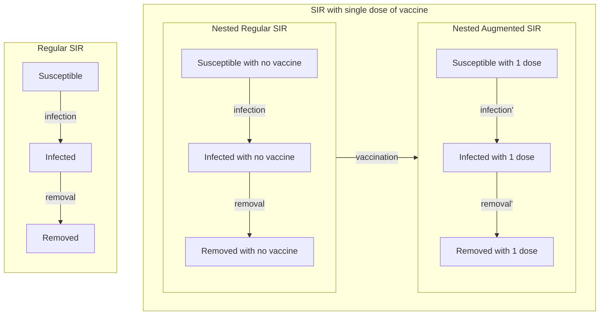

# Contagion Simulator Readme

## Overarching goal
Accommodate individual level network based stochastic contagion simulation over a geography with respect to rapidly changing contexts of pharmaceutical and non-pharmaceutical intervention measures and contagion strains.

## Table of Contents

* [Subgoals](#subgoals)
* [Compartmental models in epidemiology](#compartmental-models-in-epidemiology)
  * [Simulating non-infection edges](#simulating-non-infection-edges)
  * [Individual state management](#individual-state-management)
* [Interpreting contact matrices](#interpreting-contact-matrices)
  * [Aggregated Contact Matrix](#aggregated-contact-matrix)
  * [Location based Contact Matrix](#location-based-contact-matrix)
  * [Pre-processing as neighbour lists](#pre-processing-as-neighbour-lists)
  * [Iterating for multi-step simulation](#iterating-for-multi-step-simulation)
* [Simulating contagion spread](#simulating-contagion-spread)
  * [Infection event](#infection-event)
* [Variants of Concern](#variants-of-concern)
  * [Infection History](#infection-history)
* [Vaccination status](#vaccination-status)
  &nbsp;
  &nbsp;

## Subgoals
* Ability to design and or import Compartmental models in epidemiology on-demand.
  * Simulate non-infection transitions as a sampling of negative binomial distribution.
  * Interpret contact matrices with aggregated pairwise contact time and,
  * Interpret contact matrices with location specific contact time (with activity types)
  * Interpret contact times and context of infection probability
&nbsp;

* Ability to maintain different proportions of contagion strains.
  * Maintain variants of concerns with relative infectivity and vaccine efficacies.
&nbsp;

* Manage initial vaccination status and in-simulation vaccination disbursal.
&nbsp;

* Ability to simulate diagnostic tests with sensitivity and specificity.
&nbsp;

* Report aggregated and individual statistics of relevant compartments, transition and their combinations that provides decision support.
&nbsp;
&nbsp;

## Compartmental models in epidemiology
This is an encoding of disease progression of individuals (in Individual level model) or a aggregation of individuals (in the case of Ordinary Differential Equation models).


Given any compartment model, we can identify the "infection" propagating transition and any number of non-infection type transition.

For example, consider the:
* $$Susceptible \rightarrow Infected \rightarrow Removed$$ (**SIR**) and the
* $$Susceptible \rightarrow Latent \rightarrow Infectious \rightarrow Removed$$ (**SLIR**) model

And their corresponding stochastic edges:


For, SIR infection propagating transition is the S-I edge and for SLIR it is the S-L edge. But please note the infection propagator compartment is Infected(**I**) in both cases.

In our simulator we have the option of both designing a compartment model from scratch or import it as an adjacency matrix.

We utilise the R library igraph[^1] and initialise the list of disease model the simulator may account for and convert to its corresponding adjacency matrix, from line no. **670 - 2233** in ```Contagion_Simulator_vcalib13.R```:Individual state management

- Complex model from Dr. Seahra - line no. **684 - 1600**
- SIR - line no. **1600 - 1704**
- SIR + Testing + Isolation - line no. **1704 - 1834**
- SIR + Testing + Isolation + Contact Tracing - line no. **1834 - 1997**
- [Incomplete] SIR + Hospitalisastion + Testing + Isolation + Contact Tracing - line no. **1997 - 2233**

And a parameter to select from these existing disease model is at line. no **119**
```R
CONST_CHOSEN_DISEASE_MODEL <- "SIR"
```


For example, for SIR and SLIR the output data structure are the following matrices, where forward transitions are encoded row-wise:

 $\cdot$ | susceptible | infected | removed
--- | --- | --- | ---
**susceptible** | | $$Pr(f(contact \textunderscore time))$$ |
**infected** | | | $$\gamma$$
**removed** | | |


$\cdot$ | susceptible | latent | infectious | removed
--- | --- | --- | --- | ---
**susceptible** | | $$Pr(f(contact \textunderscore time))$$ | |
**latent** | | | $$(latency \textunderscore period)^{-1}$$ |
**infectious** | | | | $$\gamma'$$ |
**removed** | | | |

Where $\gamma$ is the inverse of mean length of infectious period or usually termed as "removal rate".
And $latency \textunderscore period$ is the mean length of time a person is carrying a contagion before becoming infectious. Therefore, for SLIR the mean period of a person carrying the contagion is $latency \textunderscore period + \frac{1}{\gamma'}$, where $\gamma'$ is the removal rate from infectious to removed compartments.
&nbsp;

### Simulating non-infection edges
Let $X_{i}$ be the state of a an individual $X$ at $i^{th}$ simulation step.
Then, $X_{i+1}$, is a state transition inferred from an adjacency matrix a.k.a transition matrix (barring infecting kind) $A \rightarrow B$ with a constant $k_{A \rightarrow B} \in [0, 1]$ is:

$$Pr(X_{i+1} = B|X_{i} = A) = k_{A \rightarrow B} $$

Please note that the probability of $X$ not transitioning, to stay in state $A$ from $i$ to $i+1$ simulation step is:

$$Pr(X_{i+1} = A|X_{i} = A) = 1 - \sum k_{A \rightarrow A'} $$
 where $A' \in \mathbb{S}_A$ set of all possible tranistion states from $A$ and, $A \neq A'$.

 In the simplest form this is a Markov Chain[^2]

 In the simulator, we encode this step as in the line no. **3033 - 3096**,
 with the function
 ```R
 evolveNonSusceptible <- function(person_id)
 ```
 This works with a global context of simulation time step ```day_index```, ```transition_matrix``` and the states of individuals encoded in ```STATE``` a 2D matrix we review in the next section.

 Please note, without introducing infection as a function of contact matrices, an individual level network based stochastic simulation may simply be run with a constant $\beta$ defining the infection rate or flow from susceptible state to the corresponding infected state.
&nbsp;

### Individual state management
Although there are more space-efficient approach to encode the state of each individual for each simulation step, this simulator uses a 2D-Matrix $State$ of dimensions: $$no \textunderscore of \textunderscore simulation \textunderscore steps_{columns} \times no \textunderscore of \textunderscore individuals_{rows}$$

This is initalised at line no. **2618**.
```R
STATE <- array(rep(NA, TOTAL_SIMULATED_PERSONS * TOTAL_SIMULATION_DAYS),
               dim = c(TOTAL_SIMULATED_PERSONS, TOTAL_SIMULATION_DAYS) )
```

For simulating a single strain of contagion, $State$ and the $ContactMatrix$ is sufficient.

*More often than not the choice of data structures have been to improve time efficiency over space, as advised by Gaia Noseworthy an initial contributor to this project*
&nbsp;
&nbsp;

## Interpreting contact matrices
For a single time-step, this may be abstracted as a function that maps two individuals $X, Y$ and a simulation step $i$ to a shared time $t$ in the aggregated case, or a list of shared times $t_1, t_2, ... t_m$ at $l$ locations for the location specific case with $l$ is independent of $m$. i.e. two individuals may have multiple shared times at multiple locations.  

$$
f(X, Y, i) \rightarrow
\begin{cases}
 t,\  if\ \  aggregated \\
t_m \in \mathbb{T}_{X,Y,i} = {t_1, t_2, ... t_m},\  if\ \  location\ based
\end{cases}
$$

The parameter to choose from aggregated or location based contact matrices is at line no. **129**
```R
CONST_CHOSEN_CONTACT_MATRIX_TYPE <- "Aggregated"
# Note: this too is loosely implemented with manual string matching
CONTACT_MATRIX_TYPE_NAMES <- c("Aggregated", "Location based")
```
Also, the simulator needs a directory to read the pairwise list of contact times as CSVs parsed from Citisketch schedule jsons, to be specified at line no. **406**
```R
# contact matrix (pairlist)
# CONTACT_MATRIX_DIR <- 'schedules_Campbellton_Control_Jan_12_2022'
CONTACT_MATRIX_DIR <- 'SIR_calib_contact_matrix'
```
&nbsp;

### Aggregated Contact Matrix
Again, we encode this in a 2D-Matrix of dimension $no \textunderscore of \textunderscore individuals \times no \textunderscore of \textunderscore individuals$ from .
This is intialised at line no. **2436 - 2520**
```R
# Read contact matrix
contact_matrix_as_pairlist <- read.table(CONTACT_MATRIX_AS_PAIRLIST_FILENAME, sep=",")

# Adding readable column names
colnames(contact_matrix_as_pairlist) <- c("person_id_1", "person_id_2", "contact_in_seconds")

# Converting to sparse matrices
sparse_contact_matrix <- sparseMatrix(i = contact_matrix_as_pairlist$person_id_1,
                                      j = contact_matrix_as_pairlist$person_id_2,
                                      x = contact_matrix_as_pairlist$contact_in_seconds,
                                      dims = c(TOTAL_SIMULATED_PERSONS, TOTAL_SIMULATED_PERSONS))

# convert to array
contact_matrix <- array( data = sparse_contact_matrix,
                         dim = c(TOTAL_SIMULATED_PERSONS, TOTAL_SIMULATED_PERSONS))
```

$\cdot$ | 1 | 2 | ... |  N
--- | --- | --- | --- | ---
**1** | | | |
**2** | | | |
**...** | | | |
**N** | | | |

&nbsp;

### Location based Contact Matrix
This is interpreted as is, we keep this as a pairlist of dimension $no \textunderscore of \textunderscore columns \times no \textunderscore of \textunderscore contact \textunderscore events$ from
This is intialised at line no. **2520 - 2594**


The no. of columns are initialised as follows:
```R
# Read contact matrix
contact_matrix_as_pairlist <- read.table(CONTACT_MATRIX_AS_PAIRLIST_FILENAME, sep=",", header = TRUE)

# Overriding column names
colnames(contact_matrix_as_pairlist) <- c("person_id_1", "person_id_2", "contact_in_seconds", "citisketch_location_id", "citisketch_location_type",  "internal_id")
```
The ```"internal id"``` is just a mapping of $g(citisketch \textunderscore location \textunderscore id, citisketch \textunderscore location \textunderscore type) \rightarrow i \in \mathbb{N} = {1, 2, ...}$
We are yet to account for $activity\ type$, it is a work in progress.

$\cdot$ | person_id_1 | person_id_2 | contact_in_seconds | citisketch_location_id | citisketch_location_type | internal_id
--- | --- | --- | --- | --- | --- | ---
**contact event  1** | | | | | |
**contact event  1** | | | | | |
**...** | | | | | |
**contact event K** | | | | | |

&nbsp;

### Pre-processing as neighbour lists
During simulation, the above data-structures are filtered or sliced by an individual id to get a their list of neighbours and then further filtered based on their state on the disease model.
Therefore, as advised by Dr. Seahra, pre-processing the neighbours into constant time lookup data-structures offers a significant speed up of simulation time.
Please note, the pre-processing step introduces a delay in simulation setup time, about 17 minutes (1023.4s) for pre-processing 30 location based contact matrices resulting in about reducing about 40 seconds from a 90 second simulation time of 210 days.  
However, as most of experiments are batches of 100~200 simulation runs, of 210 days (time-steps) with an available pool of 30 contact matrices, the one-time-cost build cost is outweighed by speedup obtained for every run.

For Aggregated interpretation, pre-processing is implemented at line **2501**
```R
for(person_id in 1:TOTAL_SIMULATED_PERSONS){
  list_day_x_person_x_contact[[matrix_index]][[person_id]] <- which(contact_matrix[person_id, ] > 0)
}
```

For Location based interpretation, it is implemented at line **2568**
```R
for(person_id in 1:TOTAL_SIMULATED_PERSONS){
  list_day_x_person_x_contact[[matrix_index]][[person_id]] <- contact_matrix_as_pairlist[which(contact_matrix_as_pairlist$person_id_1 == person_id), ]$person_id_2
  list_day_x_person_x_contact_time[[matrix_index]][[person_id]] <- contact_matrix_as_pairlist[which(contact_matrix_as_pairlist$person_id_1 == person_id), ]$contact_in_seconds
  list_day_x_person_x_contact_location_type[[matrix_index]][[person_id]] <- contact_matrix_as_pairlist[which(contact_matrix_as_pairlist$person_id_1 == person_id), ]$citisketch_location_type
  list_day_x_person_x_contact_location_id[[matrix_index]][[person_id]] <- contact_matrix_as_pairlist[which(contact_matrix_as_pairlist$person_id_1 == person_id), ]$citisketch_location_id
}
```

Both are nested loops within an outer loop which iterates over the list of available Contact Matrix files.

&nbsp;

### Iterating for multi-step simulation
At present the simulator cycles through the available contact matrices in order when the simulation step exceeds the number of available matrices. This sequence is generated at line no. **3146-3161**
```R
getContactMatrixIndexForSimDay <- function(simulation_day_index){
  if( simulation_day_index <= 1 ){
    cat("\n[FATAL ERROR] Requested simulation day index: ", simulation_day_index, " is out of bounds.",
        "\n              Expected range (2:", TOTAL_SIMULATION_DAYS, ").",
        "\n Terminating simulation")
    stop()
  } else if( (simulation_day_index) <= COUNT_CONTACT_MATRIX + 1){
    return (simulation_day_index - 1)
  }

  # else
  return( ( (simulation_day_index - 2) %% COUNT_CONTACT_MATRIX) + 1)
}

contact_matrix_index_lookup_list = sapply(2:TOTAL_SIMULATION_DAYS, getContactMatrixIndexForSimDay)
contact_matrix_index_lookup_list <- c(NA, contact_matrix_index_lookup_list)
```

This enables for swapping the (30 matrix) month long sequence for perhaps a shorter (7 matrix) weekday-weekend sequence or a longer (90 matrix) holiday season with pre-holiday and post-holiday month sequence with just changing the directory ```CONTACT_MATRIX_DIR```.

**Errata: ```Contagion_Simulator_vcalib13.R``` has a bug, when utilising ```contact_matrix_index_lookup_list``` the simulation loop incorrectly starts lookup with ```day_index == 1``` for the first day.
This exists on line no. *6353, 6356, 6421, 6632, 6635, 6640, 6664* and ill be corrected in the next release.**

Please note, it is a minor bug, effectively reducing the simulation time by 1 time step for most cases.
&nbsp;
&nbsp;

## Simulating contagion spread
To ascertain new infections for simulation step $i$, iterating over infectious individuals $X \in I_{i-1}$ and their susceptible neighbours $susceptible \textunderscore neighbour(X) = neighbour(X) \cap S_{i-1}$, for simulation step $i -1$ provides the highest simulation speed.
Especially, once any of susceptible individual has been infected by infectious individual $X_p \in I_{i-1} = {X_1, X_2, ... X_k}$, they may be removed from the overall set of Susceptibles $S_{i-1}$.
And consequently need not be considered for computing possible infection from $X_q \in I_{i - 1}, q \neq p$.
This is implemented with a for loop, at line no.: **6347-6895**

There is an alternate section that instead, iterates over set of susceptibles and their infected neighbours with a switching parameter based on count of infectious individuals, but it is not-maintained for ```Contagion_Simulator_vcalib13.R```. We plan to patch it in a subsequent release.
&nbsp;

### Infection event
A single infection event for an infected individual $X_I \in I$ to infect $X_S \in S$ with $contact \textunderscore time = t$, where $I$ and $S$ are sets of infectious and susceptible individuals respectively is a discrete probability governed by the following paramaters:
* $A$ : Base infection chance
* $t_{ramp-up}$ : A constant time parameter that offsets the infection chance to be low below a certain threshold
* $\mu_{strain}$ : Relative infectivity of a particular $strain$
* $\epsilon(inf)_{strain-{dose_n}}$ : Vaccine efficacy for a particular $strain$ of contagion carried by $X_I$ with respect to the $dose_n$, i.e. no. of doses of vaccines administered to $X_S$.

Simplifying the names and putting it all together:
$$Pr(X_I\ \  \underrightarrow{infects}\ \  X_S) = (1 - \epsilon)  \mu  A  \tanh(\frac{t}{t_{ramp-up}})$$

This is implemented at line no. **356**
```R
# Infection probability w.r.t infectivity of the variant, vaccination status of potentially infected and contact time
getInfection_probability_w_variant_w_vaccine <- function(vaccine_odds, relative_infectivity, contact_time)
```

The base infection chance is one of the primary parameter of configuration ```CONST_MAX_CHANCE``` and a series of experimental values are listed starting from line no. : **143**
```R
# Amplitude of infection      |   For Aggregated            |   For Location wise
# CONST_MAX_CHANCE <- 0.00100 # ~ 29.74% outbreaks - 500 runs | ~ 25.2% outbreaks - 500 runs
# CONST_MAX_CHANCE <- 0.00200 # ~ 75% outbreaks - 400 runs    | ~ 75% - 300 runs
# CONST_MAX_CHANCE <- 0.00250 # ~ 94% outbreaks - 200 runs    | ~ 78.57 % - 140 runs
CONST_MAX_CHANCE <- 0.00300
...
```

Please note the base infection chance may be parameterised, with resepect to contact event metadata of $location \textunderscore type$ and $activity \textunderscore type$.

On the next section we review the data structures housing $\mu_{strain}$, $\epsilon(inf)_{strain-{dose_n}}$ ```active_voc_mat``` for different strains of contagion and the ```infection_hist_mat``` keeping track of simulation run specific infection meta-data.   
&nbsp;
&nbsp;

## Variants of Concern
As the name suggests these are strains of a contagion the agencies responsible for public health monitor. In context to SARS-CoV-2, the Government of Canada maintains their Variants of Concern (VOC) and Variants of Interest(VOI) definition on their website[^3].


This simulator is fed a subset of this data along with $\mu_{strain}$, $\epsilon(inf)_{strain-{dose_n}}$ in a dataframe name ```voc_df```, intialised on line no. : **453-571**

It has the following structure:

WHO Label | variant | Relative infectivity | Vaccine dose 1 efficacy | Vaccine dose 2 efficacy | Vaccine dose 3 efficacy | Proportion
--- | --- | --- | --- | --- | --- | ---

Here "variant" is a re-label of "Parent lineage" as defined in the website[^3]

The proportion of variants to intialise as part of the initial condition for a simulation scenario, i.e first day infection population is defined at line no. **588-630**

For example, a diagnostic scenario would be to initalise all the available VOCs with equal proportions and track their propagation:
```R
voc_df <- voc_df %>% mutate_cond(`WHO label` == "Omicron" & `variant` == "B.1.1.529", 'Proportion' = 20)
voc_df <- voc_df %>% mutate_cond(`WHO label` == "Delta" & `variant` == "B.1.617.2", 'Proportion' = 20)
voc_df <- voc_df %>% mutate_cond(`WHO label` == "Wild" & `variant` == "A", 'Proportion' = 20)
voc_df <- voc_df %>% mutate_cond(`WHO label` == "Alpha" & `variant` == "B.1.1.7", 'Proportion' = 20)
voc_df <- voc_df %>% mutate_cond(`WHO label` == "Delta" & `variant` == "B.1.617.2", 'Proportion' = 20)
```

Before, beginning a simulation a subset of ```voc_df``` of proportions > 0 is initalised at line no. **2729** as ```active_voc_mat```
```R
active_voc_mat <- as.matrix.data.frame(filter(voc_df, Proportion > 0))
```
&nbsp;

### Infection History
A matrix of dimension $6_{columns} \times no \textunderscore of \textunderscore indviduals$ named ```infection_hist_mat``` maintains the spread of concurrent propagation of contagions among the individuals.  
It is re-intialised for every simulation run and has the following structure:
$\cdot$ | variant | infected on | infected by | dose 1 on | dose 2 on | dose 3 on
--- | --- | --- | --- | --- | --- | ---
**row 1** | | | | | |
**row 2** | | | | | |
**...** | | | | | |
**row N** | | | | | |  

Each row corresponds to a numeric agent id and is looked up along with ```active_voc_df``` for determining the context of each infection event.
Please note, during simulation this also provides a efficient mechanism for computing non-Markovian transitions based on age of infection. And post-simulation this may be utilised for visualising infection trees.
&nbsp;
&nbsp;

## Vaccination status
As vaccination and the lack thereof effects the overall proportions and mean infectious and hospitalisation periods, they may be encoded as duplicated contagion compartment model with different parameters as advised by Dr. Seahra.

For example, if we were to introduce vaccination to the classic SIR model, the resulting model may look like the following, side by side:



The rate at which a susceptible individual may be vaccinated, could be defined as a constant as part of the disease model graph for the simplest implementation.

However, this simulator reads province wide vaccine disbursal data and and sets vaccination chance proportional to the total population of the province from line no. **2889-2959**

This is maintained in a table ```vaccination_perday_mat```, with the structure:
day_since_jan42021 | dose1 | dose2
--- | --- | --- 

Having defined the compartments for susceptibles for each vaccination dose, the required initial simulation condition is initialised for each run, starting at line no. :  **318**


```R
# Caliberation mode (for models without vaccines)
CONST_y0 = 1.0
CONST_y1 = 0.0
CONST_y2 = 0.0
CONST_y3 = 0.0
```

[^1]: Csardi G, Nepusz T (2006). “The igraph software package for complex network research.” InterJournal, Complex Systems, 1695. https://igraph.org

[^2]: Markov chain, A Markov chain or Markov process is a stochastic model describing a sequence of possible events... https://en.wikipedia.org/wiki/Markov_chain

[^3]: SARS-CoV-2 variants: National definitions, designations and public health actions - Government of Canada https://www.canada.ca/en/public-health/services/diseases/2019-novel-coronavirus-infection/health-professionals/testing-diagnosing-case-reporting/sars-cov-2-variants-national-definitions-classifications-public-health-actions.html#a3
